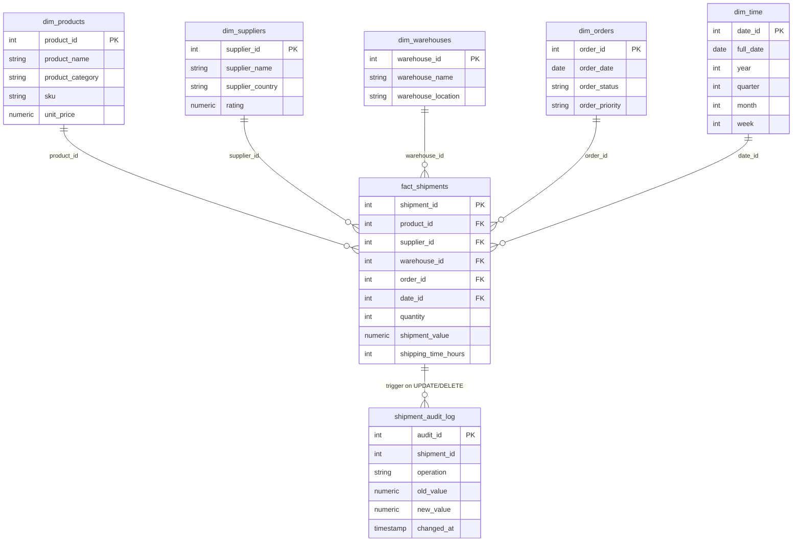

# Supply Chain Management — Data Warehouse

## Overview
A star schema data warehouse for supply chain shipment analytics, built on PostgreSQL.
Synthetic data is generated via a Python-based data generator using Faker and NumPy.
The warehouse supports both standard analytical queries and advanced SQL features
(stored procedures, views, window functions, and audit triggers).

---

## Architecture



**Design Choices:**
- **Star schema** — single fact table with 5 conformed dimensions; optimised for analytical joins
- `date_id` uses `YYYYMMDD` integer format for fast time-range filtering without date casting
- `shipment_value` is pre-computed at load time (`quantity × unit_price`) — a deliberate
  denormalisation to avoid runtime joins on every aggregation query
- Indexes placed on all FK columns and `product_category` for GROUP BY performance

---

## Stack

| Layer | Technology |
|---|---|
| Database | PostgreSQL 15 |
| Schema setup | Python + SQLAlchemy |
| Data generation | Python (Faker, NumPy, pandas) |
| Containerisation | Docker Compose |
| Testing | pytest |

---

## Project Structure

```
case_supply_chain/
├── sql/
│   ├── schema.sql              # DDL: dimensions, fact table, indexes
│   ├── queries.sql             # 5 standard analytical queries
│   └── advanced.sql            # Stored procedure, view, window query, trigger
├── src/
│   ├── setup_schema.py         # Runs schema.sql against the database
│   └── data_generator.py       # Generates and loads synthetic data
└── tests/
    └── test_supply_chain.py    # 4 pytest tests covering schema, data, and trigger
```

---

## How to Run

**0. Set up environment**

Copy `.env.example` to `.env` in the project root (required for Python scripts and tests):
```bash
cp .env.example .env
```
> The default values match `docker-compose.yml` — no edits needed for local Docker setup.

**1. Start postgres and app containers**
```bash
docker-compose up -d postgres app
```

**2. Install dependencies**
```bash
docker-compose exec app pip install -r requirements.txt
```

**3. Create schema**
```bash
docker-compose exec app python case_supply_chain/src/setup_schema.py
```

**4. Generate and load synthetic data**
```bash
docker-compose exec app python case_supply_chain/src/data_generator.py
```

**5. Run advanced SQL (stored procedure, view, trigger)**
```bash
docker-compose exec postgres psql -U admin -d assessment_dw -f /app/case_supply_chain/sql/advanced.sql
```

**6. Run tests**
```bash
docker-compose exec app pytest case_supply_chain/tests/ -v
```

---

## Data Model

| Table | Type | Rows (default) |
|---|---|---|
| `dim_time` | Dimension | ~730 (2024–2025) |
| `dim_products` | Dimension | 50 |
| `dim_suppliers` | Dimension | 20 |
| `dim_warehouses` | Dimension | 10 |
| `dim_orders` | Dimension | 500 |
| `fact_shipments` | Fact | 1,000 |

---

## Standard Queries (`queries.sql`)

1. Total quantity shipped per product category
2. Warehouse efficiency ranked by average shipping time
3. Total shipment value per supplier
4. Top 5 products by total shipment quantity
5. Shipment value distribution per product category (min / max / avg / total / count)

---

## Advanced SQL (`advanced.sql`)

| Feature | Description |
|---|---|
| Stored Procedure | `adjust_shipping_delay(shipment_id, added_hours)` — updates shipping time for a given shipment |
| View | `vw_shipment_summary` — consolidated category-level shipment and performance summary |
| Window Function | Year-over-year supplier shipment value change using `LAG()` with `PARTITION BY` |
| Trigger | `trg_shipment_audit` — automatically logs every `UPDATE` or `DELETE` on `fact_shipments` to `shipment_audit_log` |

---

## Tests

| Test | What it validates |
|---|---|
| `test_table_exists` | All 6 core tables are present in the schema |
| `test_data_count` | `fact_shipments` is populated (non-empty) |
| `test_shipment_value_calculation` | `shipment_value = quantity × unit_price` (float tolerance ±0.01) |
| `test_audit_trigger_on_update` | `UPDATE` on fact table produces a correct entry in `shipment_audit_log` |
